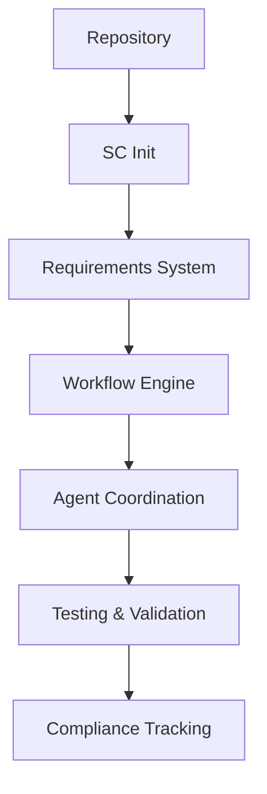
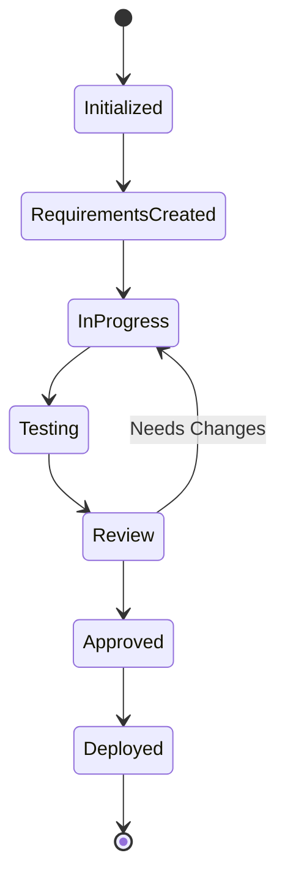
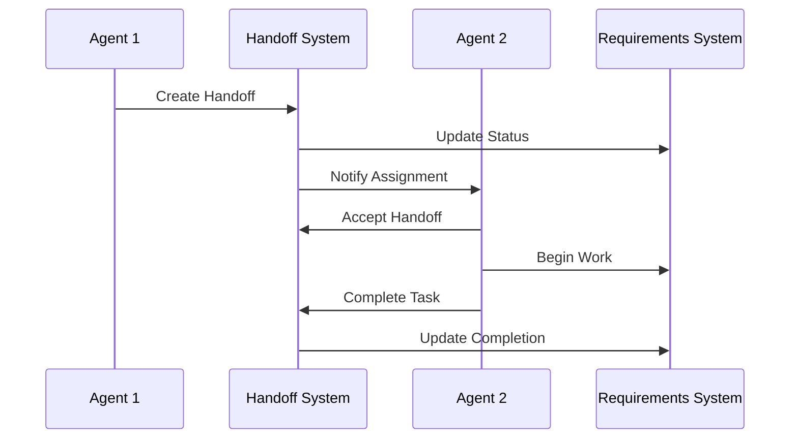
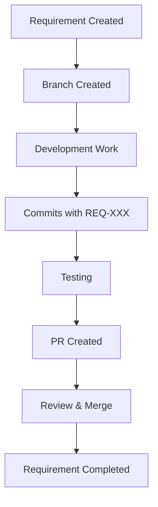
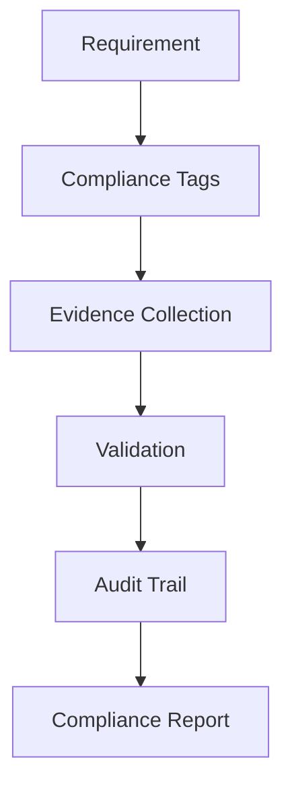
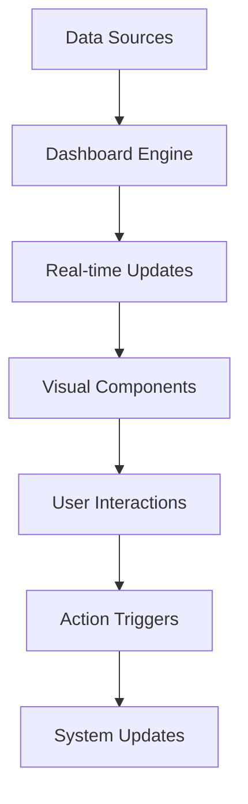

# Visual Workflow Diagrams

This document provides comprehensive visual diagrams for understanding the Supernal Coding workflow system.

## System Architecture Overview



## Workflow State Diagram



## Agent Handoff Process



## Requirements Lifecycle

```mermaid
graph LR
    A[Draft] --> B[Review]
    B --> C[Approved]
    C --> D[In Progress]
    D --> E[Testing]
    E --> F[Implemented]
    F --> G[Validated]
    
    B --> A : Needs Changes
    E --> D : Test Failed
```

## Git Integration Flow



## Compliance Tracking



## Dashboard Integration



## Related Documentation

<!-- Future workflow requirements:
- REQ-010 Mermaid Workflow Diagrams
- REQ-004 System Architecture Visualization
-->
- [Workflow System Documentation](../workflow/)


