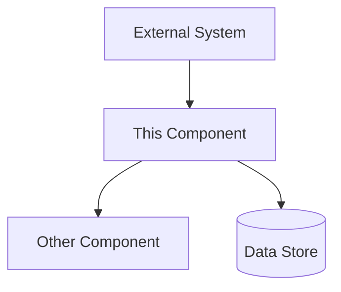
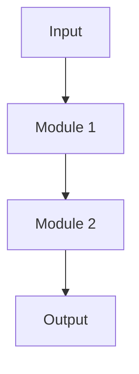
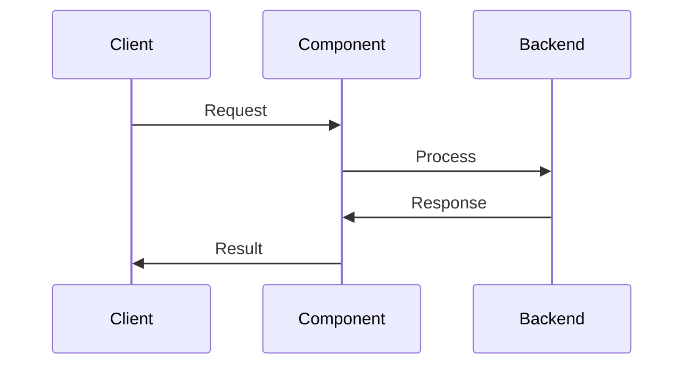
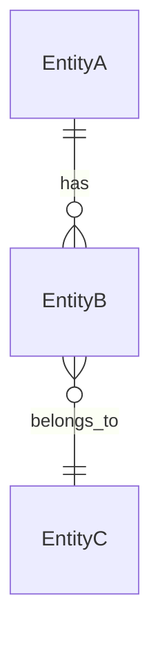
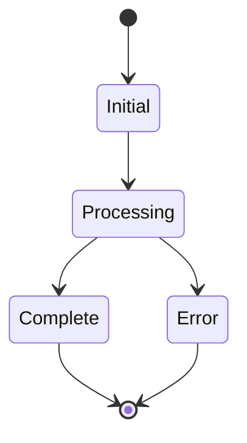

# [Component Name] Design

## 1. Overview

Brief description of what this component does and its role in the system.

This document describes the detailed design for [component name], which [primary purpose].

## 2. Design Goals

### 2.1 [Goal Category 1]

- Goal 1
- Goal 2
- Goal 3

### 2.2 [Goal Category 2]

- Goal 1
- Goal 2

## 3. Architecture Overview

### 3.1 Component Structure

High-level description of the component's internal structure.

### 3.2 Context Diagram



### 3.3 High-Level Design



## 4. Detailed Design

### 4.1 [Module/Service Name]

**Purpose**: What this module does

**Responsibilities**:

- Responsibility 1
- Responsibility 2

**Interfaces**:

- API endpoints
- Function signatures
- Protocols used

**Data Model**:

```typescript
interface DataModel {
  field1: string;
  field2: number;
  field3: boolean;
}
```

### 4.2 [Another Module/Service]

**Purpose**: What this module does

**Responsibilities**:

- Responsibility 1
- Responsibility 2

## 5. Data Flow

### 5.1 [Primary Flow Name]



**Steps**:

1. Step 1 description
2. Step 2 description
3. Step 3 description

### 5.2 [Alternative Flow Name]

Description and diagram for alternative flows.

## 6. API/Interface Design

### 6.1 External APIs

#### Endpoint: `/api/resource`

**Method**: GET/POST/PUT/DELETE

**Request**:

```json
{
  "field1": "value",
  "field2": 123
}
```

**Response**:

```json
{
  "status": "success",
  "data": {}
}
```

**Authentication**: Description

**Rate Limits**: Description

### 6.2 Internal Interfaces

Description of internal function signatures, message formats, etc.

## 7. Data Model

### 7.1 Primary Entities

#### Entity Name

| Field      | Type      | Description       | Constraints             |
| ---------- | --------- | ----------------- | ----------------------- |
| id         | UUID      | Unique identifier | Primary key             |
| name       | string    | Entity name       | Required, max 255 chars |
| created_at | timestamp | Creation time     | Auto-generated          |

### 7.2 Relationships



## 8. State Management

### 8.1 State Diagram



### 8.2 State Transitions

| From | To  | Trigger | Validation |
| ---- | --- | ------- | ---------- |

|
| Initial | Processing | User action | None |

## 9. Security Considerations

### 9.1 Authentication

How authentication is handled.

### 9.2 Authorization

Access control mechanisms.

### 9.3 Data Protection

Encryption, data handling practices.

### 9.4 Audit Logging

What gets logged and where.

## 10. Error Handling

### 10.1 Error Types

| Error Code | Description       | Recovery       |
| ---------- | ----------------- | -------------- |
| ERR-001    | Error description | How to recover |

### 10.2 Retry Logic

Description of retry mechanisms.

## 11. Performance Considerations

### 11.1 Scalability

How the component scales.

### 11.2 Caching Strategy

What is cached and cache invalidation strategy.

### 11.3 Resource Requirements

Expected CPU, memory, storage needs.

## 12. Dependencies

### 12.1 External Dependencies

| Dependency      | Purpose            | Version | Fallback    |
| --------------- | ------------------ | ------- | ----------- |
| Library/Service | What it's used for | 1.0.0   | Alternative |

### 12.2 Internal Dependencies

Components within the system that this depends on.

## 13. Testing Strategy

### 13.1 Unit Tests

What gets unit tested.

### 13.2 Integration Tests

Integration test scenarios.

### 13.3 Performance Tests

Load testing approach.

## 14. Deployment Considerations

### 14.1 Infrastructure Requirements

- Compute resources
- Storage requirements
- Network configuration

### 14.2 Configuration

Environment variables, config files needed.

### 14.3 Monitoring

Metrics to monitor, alerting thresholds.

## 15. Migration/Rollout Strategy

If applicable, how to migrate to this component or roll it out.

## Related Documents

> **Note**: Add links to related documents in your project:
> - System Architecture overview
> - Related Architecture Decision Records (ADRs)
> - Related Requirements

## Authors

- [Author Name/Team]

---

**Last Updated**: YYYY-MM-DD
**Version**: 1.0
