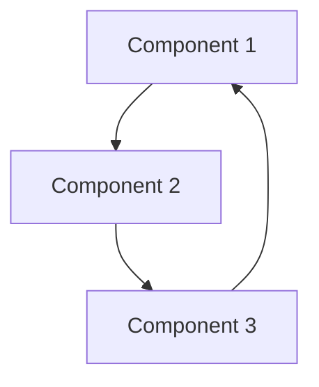

# [Pattern Name]

## Overview

Brief description of what this pattern is and what problem domain it addresses.

## Problem

What specific problem does this pattern solve? What challenges does it address?

**Symptoms**:

- Symptom 1
- Symptom 2
- Symptom 3

**Context**:
Describe the context in which this problem occurs.

## Solution

High-level description of how the pattern solves the problem.

### Core Concept

The fundamental idea behind this pattern.

### Key Principles

1. **Principle 1**: Description
2. **Principle 2**: Description
3. **Principle 3**: Description

## Structure

### Pattern Diagram



### Components

#### Component Name

**Role**: What this component does in the pattern

**Responsibilities**:

- Responsibility 1
- Responsibility 2

**Collaborations**: How it works with other components

## Implementation

### Implementation Steps

1. **Step 1**: Description and rationale
2. **Step 2**: Description and rationale
3. **Step 3**: Description and rationale

### Code Example

```typescript
// Example implementation
class ExampleClass {
  // Pattern implementation
  doSomething() {
    // Pattern logic
  }
}
```

### Configuration Example

```yaml
# Configuration for this pattern
pattern_config:
  setting1: value1
  setting2: value2
```

## Examples

### Example 1: [Use Case Name]

**Context**: Description of the specific use case

**Implementation**:

```typescript
// Specific example code
```

**Outcome**: What was achieved

### Example 2: [Use Case Name]

**Context**: Description

**Implementation**:

```typescript
// Code example
```

**Outcome**: Result

## Trade-offs

### Benefits

- **Benefit 1**: Description of advantage
  - Why this matters
  - When it's most valuable

- **Benefit 2**: Description
  - Why this matters
  - When it's most valuable

### Drawbacks

- **Drawback 1**: Description of limitation
  - Why this occurs
  - How significant it is

- **Drawback 2**: Description
  - Why this occurs
  - Mitigation strategies

## When to Use

### Appropriate Scenarios

- **Scenario 1**: When you have X and need Y
- **Scenario 2**: When performance/scalability requires Z
- **Scenario 3**: When team structure necessitates A

### Signs You Need This Pattern

- Sign 1
- Sign 2
- Sign 3

## When NOT to Use

### Inappropriate Scenarios

- **Scenario 1**: When X is true because Y
- **Scenario 2**: When team size is Z
- **Scenario 3**: When requirements don't include A

### Alternatives to Consider

- **Alternative 1**: When to use this instead
- **Alternative 2**: When to use this instead

## Related Patterns

### Complementary Patterns

- **[Pattern Name] (see related patterns)**: How they work together
- **[Pattern Name] (see related patterns)**: Synergies

### Alternative Patterns

- **[Pattern Name] (see related patterns)**: When to choose this instead
- **[Pattern Name] (see related patterns)**: Trade-offs between them

### Patterns to Combine

- **[Pattern Name] (see related patterns) + This Pattern**: Combined benefits

## Testing Strategy

### How to Test

- Test approach 1
- Test approach 2

### Common Test Scenarios

```typescript
describe('Pattern Implementation', () => {
  it('should handle X correctly', () => {
    // Test code
  });
});
```

## Variations

### Variation 1: [Variation Name]

**Difference**: How it differs from the standard pattern

**When to use**: Circumstances for this variation

### Variation 2: [Variation Name]

**Difference**: Key differences

**When to use**: Appropriate scenarios

## Anti-Patterns

### Anti-Pattern 1: [Name]

**What**: Description of the anti-pattern

**Why it's bad**: Consequences

**How to avoid**: Prevention strategies

## Migration Guide

If migrating from a different pattern or approach:

### From [Old Approach]

1. Step 1
2. Step 2
3. Step 3

### Backward Compatibility

How to maintain compatibility during migration.

## Used By

### Components Using This Pattern

- [Component Name] (see project documentation) - How it's used
- [Component Name] (see project documentation) - How it's used

### Systems Using This Pattern

- System 1 - Application details
- System 2 - Application details

## References

### Internal Documentation

- [Related ADR] (see project documentation)
- [System Architecture] (see project documentation)

### External Resources

- [Article/Book Title](https://example.com) - Description
- [Pattern Catalog](https://example.com) - Description

## Authors

- [Author Name/Team]

---

**Categories**: communication | data | integration | security | deployment  
**Last Updated**: YYYY-MM-DD  
**Status**: approved | draft | deprecated
