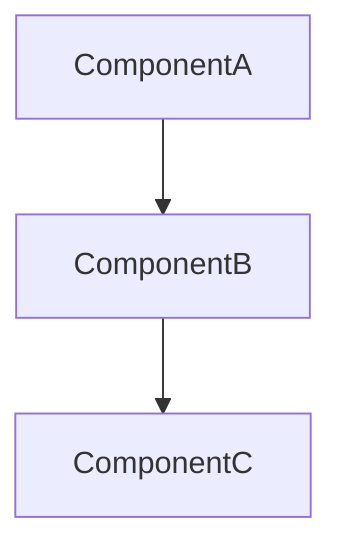
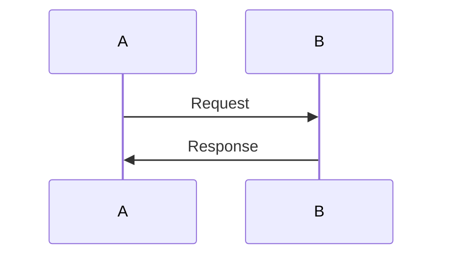

# [N] [Section Title]

## [N.1] Purpose

Brief description of what this section addresses in the system architecture.

## [N.2] [Main Topic]

### [N.2.1] Subsection

Detailed content...

## Quality Goals (if Section 1 - Introduction)

| Priority | Quality Goal  | Scenario                |
| -------- | ------------- | ----------------------- |
| 1        | **Goal Name** | Scenario description... |

## Scope (if Section 1 - Introduction)

- **Capability 1**
  - Details...
  - References to other sections...

## Value Proposition (if Section 1 - Introduction)

The platform delivers:

- **Benefit 1**: Description
- **Benefit 2**: Description

## Architecture Presentation (if Section 1 - Introduction)

This document presents the architecture through multiple views:

- **System Overview**: High-level components and flows
- **Decomposition View**: Functional breakdown
- **Network View**: Network interactions
- **Deployment View**: Infrastructure deployment
- **Security View**: Security boundaries
- **Additional Considerations**: Compliance, costs, operations

## System Overview (if Section 2)

High-level description of the system, major components, and user flows.

### Architecture Goals

### Key Constraints

## Decomposition View (if Section 3)

### Component Breakdown

#### Component Name

- **Responsibility**: What it does
- **Interfaces**: APIs, protocols
- **Dependencies**: What it depends on

## Network View (if Section 4)

### Network Topology

### Communication Protocols

## Data Flow View (if Section 5)

### Data Flow Diagrams

### Data Transformations

## Deployment View (if Section 6)

### Infrastructure Components

### Deployment Topology

## Security View (if Section 7)

### Security Boundaries

### Access Controls

### Compliance Considerations

## Additional Considerations (if Section 8)

### Performance

### Scalability

### Cost Estimates

### Operational Considerations

---

**Related Documents**:

- [Related System Doc] (see project documentation)
- [ADR-NNN] (see project documentation)

**Last Updated**: YYYY-MM-DD
