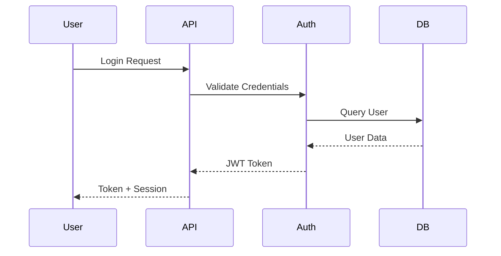
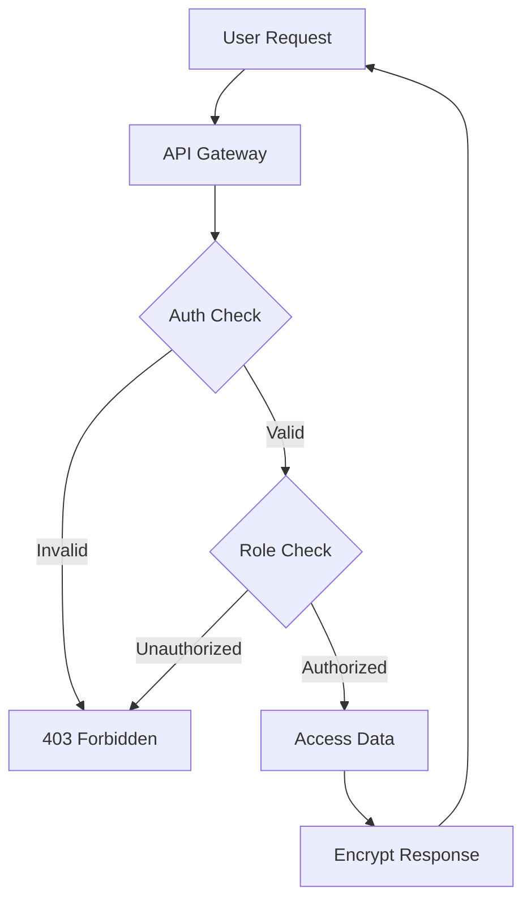

# Threat Model: [System/Component Name]

## 1. System Overview

### 1.1 Description

Brief description of the system or component being analyzed.

### 1.2 Assets

What needs protection:

- **Data**: User data, credentials, PII, financial data
- **Services**: API endpoints, authentication services
- **Infrastructure**: Servers, databases, networks

### 1.3 Trust Boundaries

- External network → Firewall → Internal network
- Public API → Authentication → Internal services
- User input → Validation → Database

## 2. Threat Identification (STRIDE)

### 2.1 Spoofing Identity

**Threats**:

- T-001: Attacker impersonates legitimate user
- T-002: Service spoofing attacks

**Affected Assets**: Authentication system, user sessions

**Likelihood**: Medium | **Impact**: High | **Risk**: High

### 2.2 Tampering with Data

**Threats**:

- T-003: Man-in-the-middle attacks
- T-004: Database injection

**Affected Assets**: Data in transit, data at rest

**Likelihood**: Medium | **Impact**: High | **Risk**: High

### 2.3 Repudiation

**Threats**:

- T-005: User denies performed action
- T-006: Missing audit trail

**Affected Assets**: Audit logs, transaction records

**Likelihood**: Low | **Impact**: Medium | **Risk**: Low

### 2.4 Information Disclosure

**Threats**:

- T-007: Unauthorized data access
- T-008: Information leakage in errors

**Affected Assets**: User data, system internals

**Likelihood**: High | **Impact**: High | **Risk**: Critical

### 2.5 Denial of Service

**Threats**:

- T-009: Resource exhaustion
- T-010: DDoS attacks

**Affected Assets**: API endpoints, services

**Likelihood**: Medium | **Impact**: Medium | **Risk**: Medium

### 2.6 Elevation of Privilege

**Threats**:

- T-011: Privilege escalation
- T-012: Authorization bypass

**Affected Assets**: Admin functions, sensitive operations

**Likelihood**: Medium | **Impact**: Critical | **Risk**: Critical

## 3. Risk Assessment

| ID    | Threat               | Likelihood | Impact   | Risk Level | Priority |
| ----- | -------------------- | ---------- | -------- | ---------- | -------- |
| T-001 | User impersonation   | Medium     | High     | High       | P1       |
| T-004 | SQL injection        | High       | Critical | Critical   | P0       |
| T-007 | Data breach          | High       | Critical | Critical   | P0       |
| T-011 | Privilege escalation | Medium     | Critical | Critical   | P0       |

**Risk Levels**:

- **Critical**: Immediate action required
- **High**: Address in current sprint
- **Medium**: Address in next 2-3 sprints
- **Low**: Backlog, review quarterly

## 4. Mitigations

### 4.1 Existing Controls

- Multi-factor authentication (MFA)
- Encrypted data in transit (TLS 1.3)
- Encrypted data at rest (AES-256)
- Role-based access control (RBAC)
- Input validation and sanitization
- Rate limiting and throttling
- Comprehensive audit logging

### 4.2 Recommended Mitigations

#### M-001: Implement Token Rotation

**Addresses**: T-001 (User impersonation)
**Description**: Rotate authentication tokens every 15 minutes
**Priority**: P1
**Timeline**: Sprint 3
**Owner**: Auth Team

#### M-002: Add Prepared Statements

**Addresses**: T-004 (SQL injection)
**Description**: Replace all dynamic SQL with prepared statements
**Priority**: P0
**Timeline**: Sprint 1
**Owner**: Backend Team

#### M-003: Implement Data Loss Prevention

**Addresses**: T-007 (Data disclosure)
**Description**: Scan outbound data for sensitive information
**Priority**: P0
**Timeline**: Sprint 2
**Owner**: Security Team

## 5. Data Flow Diagrams

### 5.1 Authentication Flow



### 5.2 Data Access Flow



## 6. Attack Trees

### 6.1 Compromise User Account

```
Goal: Gain Unauthorized Access
├── OR: Steal Credentials
│   ├── Phishing attack
│   ├── Credential stuffing
│   └── Brute force
├── OR: Session Hijacking
│   ├── XSS attack
│   └── Man-in-the-middle
└── OR: Exploit Vulnerability
    ├── SQL injection
    └── Authentication bypass
```

## 7. Security Requirements

Based on identified threats, the following security requirements are defined:

- **SEC-001**: All authentication must use MFA
- **SEC-002**: All data in transit must use TLS 1.3+
- **SEC-003**: All sensitive data at rest must be encrypted (AES-256)
- **SEC-004**: All API endpoints must implement rate limiting
- **SEC-005**: All user input must be validated and sanitized
- **SEC-006**: All database queries must use prepared statements
- **SEC-007**: All actions must be logged with user ID and timestamp
- **SEC-008**: All admin functions require re-authentication

## 8. Monitoring & Detection

### 8.1 Security Metrics

- Failed authentication attempts
- Privilege escalation attempts
- Unusual data access patterns
- API rate limit violations
- Error rates by endpoint

### 8.2 Alerting Thresholds

- 5+ failed logins within 5 minutes → Alert
- Any privilege escalation attempt → Critical alert
- 10x normal data access volume → Alert
- Any SQL error → Review logs

## 9. Incident Response

### 9.1 Detection

- Automated alerts trigger investigation
- Security team reviews weekly metrics
- Monthly threat model review

### 9.2 Response Procedures

1. Confirm incident
2. Contain threat (isolate affected systems)
3. Eradicate threat (patch, remove access)
4. Recover (restore from backup if needed)
5. Post-incident review
6. Update threat model

## 10. Review & Updates

**Review Cycle**: Quarterly or after significant changes

**Trigger Events**:

- New feature deployment
- Architecture changes
- Security incident
- Compliance requirement changes
- New threat intelligence

**Review Checklist**:

- [ ] All threats still relevant?
- [ ] New threats identified?
- [ ] Mitigations effective?
- [ ] Risk levels accurate?
- [ ] Controls up to date?

---

**Last Review**: YYYY-MM-DD  
**Next Review**: YYYY-MM-DD  
**Reviewed By**: [Name, Role]  
**Approved By**: [Name, Role]
