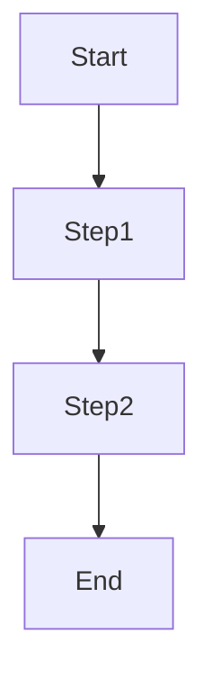

# [SOP Title]

## Purpose

Clear, one-sentence purpose of this SOP.

## Scope

What this SOP covers and doesn't cover.

**Covers**:

- Topic 1
- Topic 2

**Does Not Cover**:

- Out of scope item 1
- Out of scope item 2

## Audience

Who should read and follow this SOP:

- **Primary**: [Role]
- **Secondary**: [Role]
- **References**: [Role]

## Prerequisites

What you need before following this SOP:

- [ ] Prerequisite 1
- [ ] Prerequisite 2

## Process Overview



## Detailed Steps

### Step 1: [Step Name]

**Goal**: What this step accomplishes

**Process**:

1. Substep 1
2. Substep 2
3. Substep 3

**Outputs**:

- Output 1
- Output 2

**Validation**:

- [ ] Check 1
- [ ] Check 2

### Step 2: [Step Name]

**Goal**: What this step accomplishes

**Process**:

1. Substep 1
2. Substep 2

**Outputs**:

- Output 1

**Validation**:

- [ ] Check 1

## Examples

### Example 1: [Scenario Name]

**Context**: Description

**Process**:

```
Step-by-step example
```

**Outcome**: Result achieved

## Tools & Resources

### Required Tools

- Tool 1: Purpose
- Tool 2: Purpose

### Helpful Resources

- [Resource Name] (add link) - Description
- [Resource Name] (add link) - Description

## Quality Gates

### Entry Criteria

- [ ] Criterion 1
- [ ] Criterion 2

### Exit Criteria

- [ ] Criterion 1
- [ ] Criterion 2

## Common Issues & Solutions

### Issue 1: [Problem]

**Symptoms**: What you see
**Cause**: Why it happens
**Solution**: How to fix

### Issue 2: [Problem]

**Symptoms**: What you see
**Cause**: Why it happens
**Solution**: How to fix

## Related SOPs

- **Prerequisite**: [SOP Reference] (add link) - What comes before
- **Follow-up**: [SOP Reference] (add link) - What comes after
- **Related**: [SOP Reference] (add link) - Related workflow

## Change History

| Version | Date       | Changes         | Author |
| ------- | ---------- | --------------- | ------ |
| 1.0     | YYYY-MM-DD | Initial version | Team   |

---

**Maintained by**: [Team/Role]  
**Review Frequency**: [Monthly/Quarterly/Annually]  
**Last Reviewed**: YYYY-MM-DD
